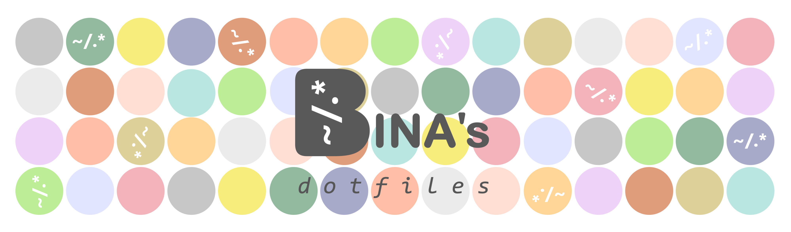
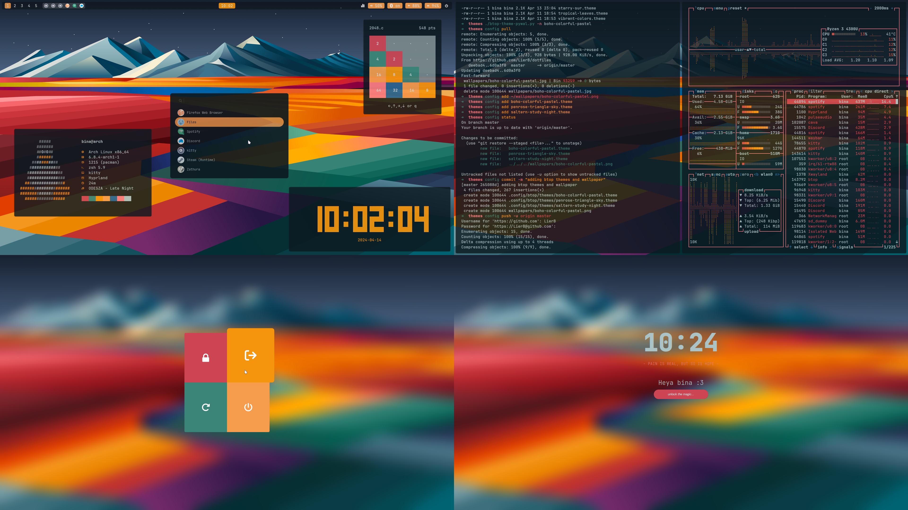
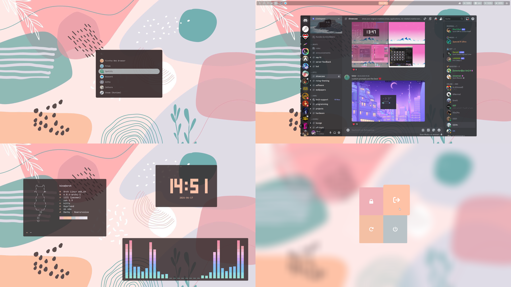
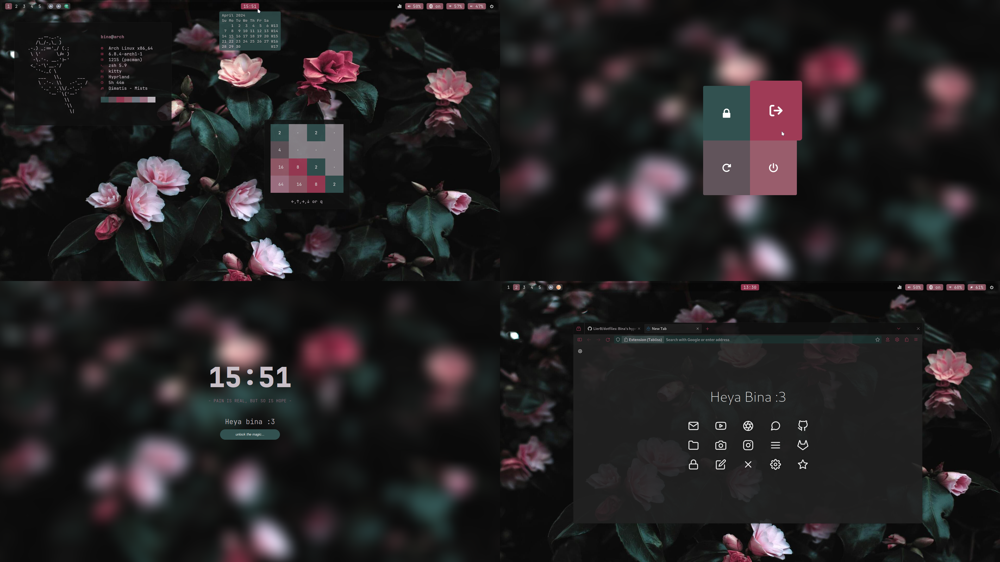
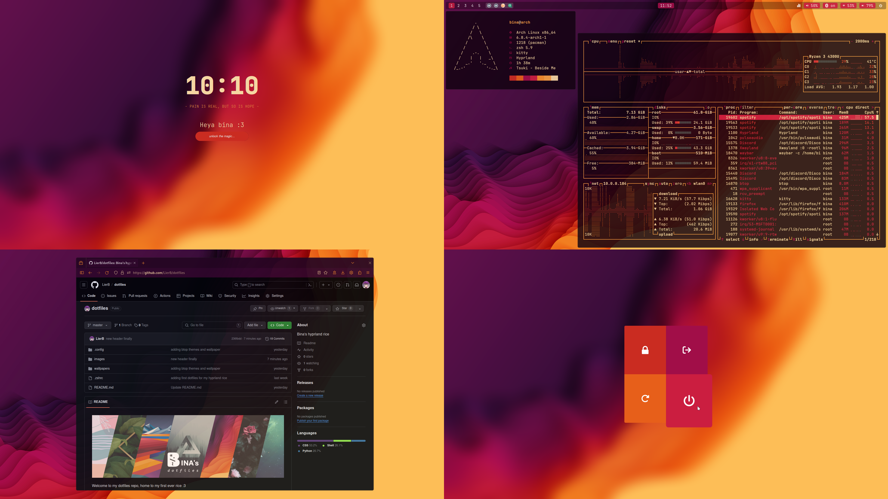

  

Welcome to my dotfiles repo, home to my first ever rice :3

I've chosen to utilize the Hyprland tiling window manager as the heart of my personalized Linux environment. Pywal as the color-scheme generator adapts to any wallpaper, ensuring a harmonious visual experience throughout my setup making it simple to tailor the ambiance to match my current mood. 

Feel free to explore my files and reach out to me with any questions or suggestions. Let's dive into the world of Linux customization together!

## Packages
list of main programs, applications, tools and themes that I use for my rice
| component           | resource  
| :---------          | :-------  
| window manager      | [hyprland](https://github.com/hyprwm/Hyprland)
| color theme         | [pywal](https://github.com/dylanaraps/pywal)
| terminal emulator   | [kitty](https://github.com/kovidgoyal/kitty)
| shell               | [zsh](https://github.com/ohmyzsh)
| fetch displayer     | [neofetch](https://github.com/dylanaraps/neofetch)
| resource monitor    | [btop](https://github.com/aristocratos/btop)
| bar                 | [waybar](https://github.com/Alexays/Waybar)
| logout menu         | [wlogout](https://github.com/ArtsyMacaw/wlogout)
| lockscreen          | [hyprlock](https://github.com/hyprwm/hyprlock)
| app launcher        | [wofi](https://hg.sr.ht/~scoopta/wofi)
| wallpaper daemon    | [swww](https://github.com/LGFae/swww)
| screenshot tool     | [grimblast](https://github.com/hyprwm/contrib/tree/main/grimblast)
| cursor              | [Rosé Pine Dawn](https://github.com/rose-pine/cursor)
| icons               | [Ketsa](https://github.com/zayronxio/ketsa-icon-theme) & [Reversal](https://github.com/yeyushengfan258/Reversal-icon-theme)
| font                | [JetBrains Mono](https://github.com/JetBrains/JetBrainsMono)
| document viewer     | [zathura](https://github.com/pwmt/zathura)
| audio visualizer    | [cava](https://github.com/karlstav/cava)
| terminal clock      | [tty-clock](https://github.com/xorg62/tty-clock)
| terminal games      | [snake](https://github.com/PonasKovas/snake) & [2048](https://github.com/mevdschee/2048.c)

plans... 

...to improve the rice. 

I intend to implement the following tools in the (near) future: 

| component           | resource  
| :---------          | :-------  
| login menu          | [sddm](https://github.com/sddm/sddm) 
| notifications daemon | [dunst](https://github.com/dunst-project/dunst)
| firefox startpage    | [firefoxCSS](https://github.com/Aris-t2/CustomCSSforFx) 
| widgets             | [ags](https://github.com/Aylur/ags) or [eww](https://github.com/elkowar/eww)
| text/code editor    | [neovim](https://neovim.io/) and [code-oss](https://github.com/microsoft/vscode)
| typing test tool    | [tt](https://github.com/lemnos/tt) or [monk-minl](https://github.com/shikhar13012001/monk-minal)

Thanks to many positive reactions, I also plan to write an automatic installation script for my rice. 

## Showcase

This is how my rice could look like. The simple act of changing the wallpaper transforms the entire ambiance - thanks to pywal, my rice can evolve into a canvas of endless possibilities.

Hope you enjoy it :3

### Penrose triangle forest

  

### Saltern study night

  

### Boho colorful pastel

  

### Tropical leaves

  

### Penrose triangle sky

  

### Moody flowers

  

### Vibrant colors

  

